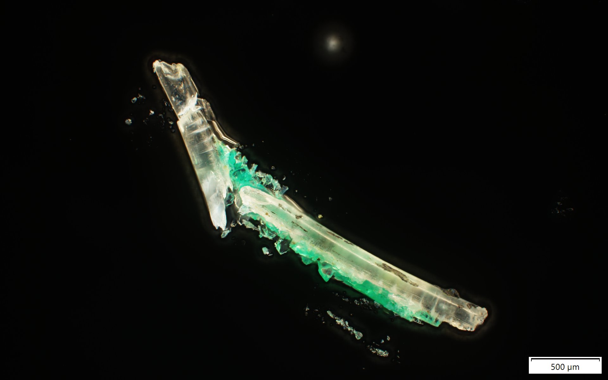
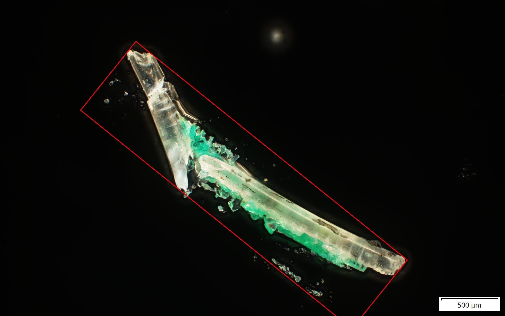
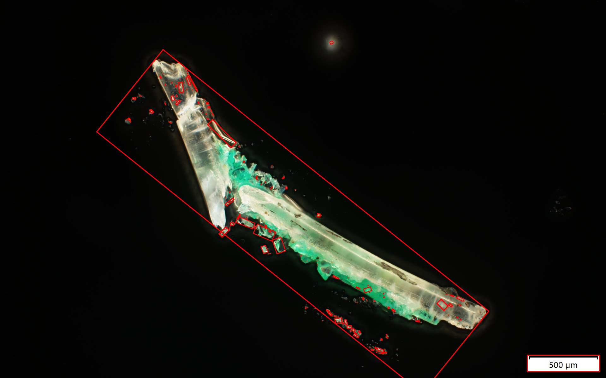

# Microplastic Particle Detection 

Application designed to measure the prevalence of microplastics in Narragansett Bay, Rhode Island. Detects and measures the size of particles caught using a 330 micron net and photographed with an Olympus BX63 Fluorescence Microscope.

Takes as an imput:

  

Outputs a file with a bounding box around the predominant plastic particle:

  

And outputs a file with bounding boxes around all particles:

  

These photos can be used to manually measure the size of microplastic particles and their prevalence, but future versions will measure
these automatically. 

